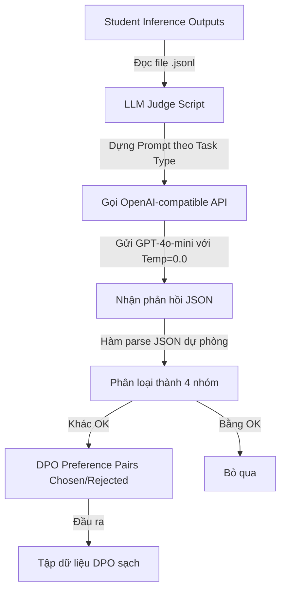

# Tài liệu Chi tiết về LLM Judge (GPT-4o-mini) trong DPO Pipeline

Tài liệu này tổng hợp chi tiết cấu trúc, prompt, tham số cấu hình, và thuật toán phân loại của bộ giám khảo thông minh **LLM Judge (sử dụng GPT-4o-mini)**. Đây là công cụ thay thế cho bộ lọc Rule-based (Regex & ROUGE-L) trước đây để chẩn đoán lỗi của mô hình Học sinh (Student) và chuẩn bị dữ liệu chất lượng cao cho căn chỉnh DPO (Direct Preference Optimization).

---

## 1. Kiến trúc Tổng quan và Luồng Xử lý

LLM Judge đóng vai trò là chốt chặn chẩn đoán lỗi ở Phase 3 của dự án Distillation. Dưới đây là sơ đồ luồng hoạt động:



---

## 2. Dữ liệu Đầu vào (Input Variables)

Để GPT-4o-mini đánh giá chính xác ngữ nghĩa và lập luận, hệ thống truyền vào **5 trường thông tin** cho mỗi mẫu dữ liệu:

| Tên trường       | Vai trò trong quá trình đánh giá                                            |
| :--------------- | :-------------------------------------------------------------------------- |
| `task_type`      | Quyết định tiêu chí chấm điểm (`nli`, `multi_choice`, `syllogism`).         |
| `instruction`    | Yêu cầu hoặc chỉ dẫn của bài toán gốc (để Judge nắm luật chơi).             |
| `input`          | Câu hỏi pháp lý hoặc đoạn văn bản gốc đi kèm.                               |
| `ground_truth`   | Câu trả lời chuẩn (bao gồm lập luận `<think>` nếu có) dùng làm mốc so sánh. |
| `student_output` | Câu trả lời thực tế của mô hình Student cần được chẩn đoán.                 |

---

## 3. Hệ thống Prompts của LLM Judge

Hệ thống prompt được thiết kế để ép mô hình trả về cấu trúc định dạng JSON nghiêm ngặt và tập trung vào các đặc thù của từng loại bài toán pháp lý.

### 3.1. System Prompt
```text
Bạn là chuyên gia đánh giá chất lượng câu trả lời pháp luật Việt Nam. 
Nhiệm vụ: so sánh câu trả lời student với đáp án chuẩn, đánh giá answer_correct và thinking_good. 
Trả lời ĐÚNG JSON format được yêu cầu, KHÔNG thêm gì khác.
```

### 3.2. Tiêu chí Đánh giá theo Từng Task (`criteria`)

*   **NLI (Đánh giá mức độ liên quan của văn bản pháp lý):**
    ```text
    **Tiêu chí NLI:**
    - Chỉ cần xác định đúng: "Có liên quan" hay "Không liên quan"
    - Bỏ qua phần giải thích, chỉ xét KẾT LUẬN CHÍNH
    - Nếu student nói lan man nhưng kết luận cuối cùng đúng → answer_correct = true
    - Nếu student tự mâu thuẫn (nói cả "có" lẫn "không") → lấy KẾT LUẬN ĐẦU TIÊN
    ```

*   **Multi Choice (Trắc nghiệm nhiều lựa chọn):**
    ```text
    **Tiêu chí Multiple Choice:**
    - Chỉ cần chọn đúng đáp án (A/B/C/D)
    - Bỏ qua cách diễn đạt, chỉ xét ĐÁP ÁN ĐƯỢC CHỌN
    - Nếu student chọn đúng chữ cái nhưng giải thích sai → answer_correct = true, thinking_good = false
    ```

*   **Syllogism (Lập luận suy diễn pháp luật):**
    ```text
    **Tiêu chí Syllogism:**
    - So sánh NỘI DUNG và Ý NGHĨA, không chỉ từ ngữ
    - Các con số, mức phạt, thời hạn phải CHÍNH XÁC (sai số liệu = sai)
    - Điều luật viện dẫn phải đúng
    - Nếu ý đúng nhưng thiếu chi tiết quan trọng → answer_correct = false
    - Nếu student hallucinate (bịa thông tin) → answer_correct = false, thinking_good = false
    ```

### 3.3. Yêu cầu Cấu trúc Đầu ra (Output Format)
Đầu ra mong muốn là một JSON thuần túy có dạng:
```json
{
  "answer_correct": true/false,
  "thinking_good": true/false,
  "confidence": 0.0-1.0,
  "reason": "Giải thích ngắn gọn lý do trong 1-2 câu"
}
```

---

## 4. Tham số cấu hình API & Chiến lược vận hành

Các tham số này được thiết lập trong file triển khai [`judge_dpo.py`](file:///e:/DoCode/1%20VN-Legal-AI/legal-slm-distillation-pdq/docs/distillation_apikey/judge_dpo.py):

*   **`model`**: `"gh/gpt-4o-mini"`
*   **`temperature`**: `0.0` (Đặt bằng 0 để triệt tiêu tính ngẫu nhiên, giúp kết quả đánh giá ổn định qua các lần chạy khác nhau).
*   **`max_tokens`**: `256` (Giới hạn tối đa số token sinh ra để tối ưu hóa tốc độ và tiết kiệm chi phí API).
*   **`concurrency` (Mặc định: `10`)**: Sử dụng cơ chế bất đồng bộ `asyncio.Semaphore` để giới hạn số lượng request song song đồng thời gửi lên API, hạn chế bị quá tải server.
*   **`delay`**: Chèn một khoảng nghỉ `await asyncio.sleep(1.0)` sau mỗi mẫu thử để tránh chạm ngưỡng giới hạn băng thông (Rate Limit 429).
*   **`max_retries`**: Tối đa 5 lần thử lại khi gặp sự cố mạng hoặc lỗi quá tải với thời gian giãn cách tăng dần (Exponential Backoff):
    *   *Lỗi 429 (Rate Limit)*: Chờ `10s * (lần_thử)` (ví dụ: 10s, 20s, 30s...).
    *   *Các lỗi khác*: Chờ `2 ^ lần_thử` giây (ví dụ: 1s, 2s, 4s, 8s...).

---

## 5. Thuật toán Phân loại Phán quyết (Classification Logic)

Sau khi nhận kết quả JSON từ GPT-4o-mini, Judge phân loại mẫu dữ liệu đó vào một trong bốn nhóm trạng thái sau:

| Nhóm phân loại | Trạng thái Đáp án (`answer_correct`) | Trạng thái Lập luận (`thinking_good`) | Diễn giải & Hành động                                                                                                                    |
| :------------- | :----------------------------------: | :-----------------------------------: | :--------------------------------------------------------------------------------------------------------------------------------------- |
| **`OK`**       |               **True**               |               **True**                | Student trả lời đúng và có logic lập luận chuẩn xác. **(Bỏ qua, không đưa vào tập DPO)**.                                                |
| **`RISKY`**    |               **True**               |               **False**               | Student đoán mò đúng đáp án nhưng lập luận bị rỗng hoặc sai logic. **(Chọn làm DPO candidate)**.                                         |
| **`PARTIAL`**  |              **False**               |               **True**                | Quá trình suy luận của Student hợp lý nhưng kết luận cuối cùng bị sai sót nhẹ hoặc lệch hướng ở bước cuối. **(Chọn làm DPO candidate)**. |
| **`WRONG`**    |              **False**               |               **False**               | Sai toàn bộ cả đáp án lẫn suy luận logic. **(Chọn làm DPO candidate)**.                                                                  |

> [!IMPORTANT]
> Cặp DPO Preference Pairs sẽ được tạo ra từ 3 nhóm: `RISKY`, `PARTIAL`, và `WRONG`.
> *   **Chosen response:** Lấy từ phần `ground_truth` của dữ liệu gốc.
> *   **Rejected response:** Lấy từ phần `student_output` đã bị chẩn đoán lỗi.

---

## 6. Các cơ chế bổ trợ quan trọng trong Code

### 6.1. Cơ chế Parse JSON Dự phòng (Robust Parsing)
LLM thỉnh thoảng có thể vi phạm hướng dẫn và trả kèm mã markdown block hoặc ký tự thừa. Hàm `_parse_judge_response` xử lý qua 3 tầng dự phòng:
1.  Cố gắng parse trực tiếp bằng `json.loads(raw.strip())`.
2.  Nếu thất bại, dùng Regex tìm kiếm khối markdown dạng ` ```json { ... } ``` ` hoặc ` ``` { ... } ``` `.
3.  Nếu vẫn thất bại, dùng Regex quét để lấy cụm ký tự đầu tiên khớp dạng `{ ... "answer_correct" ... }`.

### 6.2. Cơ chế Crash Recovery (Resume)
Khi chạy hàng nghìn mẫu pháp luật, tiến trình có thể bị gián đoạn (do mất mạng, hết hạn API key...). 
Hệ thống sử dụng hàm `load_done()` để quét file kết quả đã ghi từ trước (`.jsonl`), nạp danh sách các `id` đã chấm xong và tự động bỏ qua chúng để tiếp tục xử lý các phần còn lại khi chạy lại lệnh.

---

## 7. So sánh: LLM Judge vs Rule-based (Regex/ROUGE-L)

| Đặc trưng                            | Rule-based (Cũ)                                                                                                        | LLM Judge (Mới - GPT-4o-mini)                                                                                          |
| :----------------------------------- | :--------------------------------------------------------------------------------------------------------------------- | :--------------------------------------------------------------------------------------------------------------------- |
| **Cơ chế hoạt động**                 | Sử dụng Regex cứng để tìm nhãn và đo độ tương đồng từ vựng bằng điểm ROUGE-L.                                          | Đọc hiểu ngữ nghĩa toàn bộ nội dung Câu hỏi, Đáp án chuẩn và Câu trả lời của Student.                                  |
| **Độ chính xác**                     | Thấp. Dễ chấm sai (ví dụ: câu NLI có cấu trúc "Có... nhưng không liên quan" dễ bị regex bắt nhầm nhãn "Có liên quan"). | Cao. Nhận diện được sắc thái ngôn ngữ pháp lý và logic thực tế.                                                        |
| **Phát hiện lỗi suy luận**           | Hạn chế. Chỉ so sánh ROUGE-L thô sơ giữa các từ trong khối `<think>`.                                                  | Tốt. GPT-4o-mini đánh giá được sự hợp lý của chuỗi lập luận pháp lý.                                                   |
| **Hiệu suất về thời gian & chi phí** | Cực nhanh (vài giây), hoàn toàn miễn phí.                                                                              | Chậm hơn (mất 15-30 phút tùy concurrency), tốn chi phí gọi API (~$5-$7 cho tập dữ liệu lớn).                           |
| **Tác động lên dữ liệu DPO**         | Tạo ra nhiều cặp dữ liệu rác/mất cân bằng (nhiều mẫu bị phân loại nhầm thành RISKY hoặc PARTIAL).                      | **Dữ liệu DPO sạch hơn rất nhiều**, giúp quá trình tinh chỉnh DPO đạt độ hội tụ tối đa (Reward Accuracy chạm mốc 1.0). |
